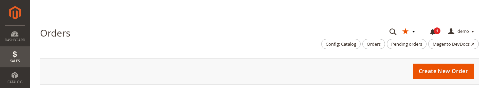
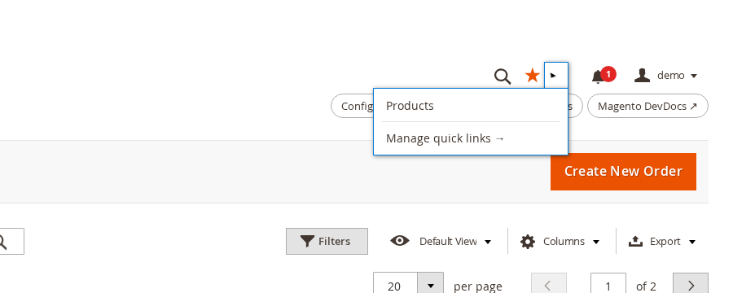
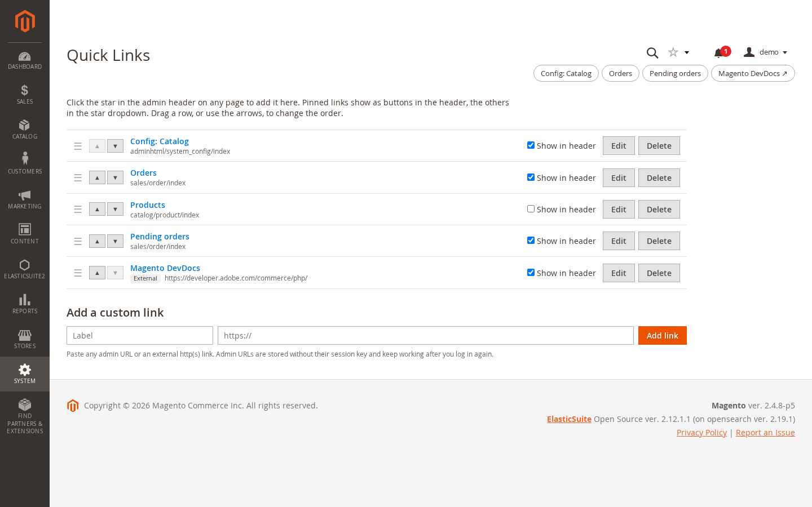
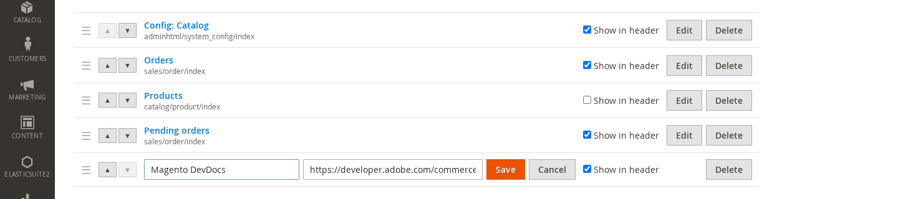
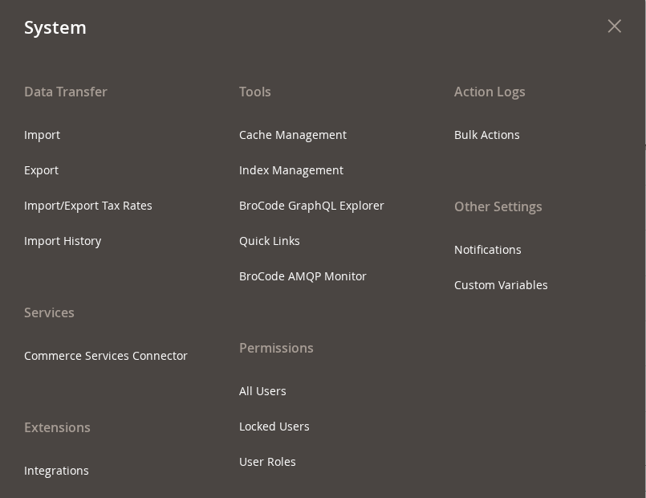

# BroCode_AdminhtmlQuickLinks

Personal quick links for Magento 2 admin users. Star any backend page, and it sits one
click away in the admin header on every page after that.

```bash
composer require brocode/module-adminhtml-quicklinks
bin/magento module:enable BroCode_AdminhtmlQuickLinks
bin/magento setup:upgrade
bin/magento cache:flush
```

In production mode, also run `setup:di:compile` and `setup:static-content:deploy` as
usual.



## The problem

Admin work keeps returning to the same few pages: a config section, the order grid, one
product being worked on this week. Magento has no bookmarks for the backend. A browser
bookmark doesn't help either, because every admin URL carries a secret key that
changes with each login. The bookmark stops working the next morning and redirects to
the dashboard.

## What this does

- **A star in the admin header** favourites the page you are on, and clicking it again
  removes the page. A filled star means the current page is already a quick link. The
  label defaults to the page title ("Orders", "Products") and can be renamed later.
- **Pinned links show as buttons in their own header row**, so each one is a single
  click away, with no dropdown to open first.
- **Unpinned links go into the dropdown next to the star.** Pinning is per link, so the
  daily pages stay visible and the occasional ones wait in the dropdown. The dropdown
  always ends with a fixed *Manage quick links →* entry.



- **System → Tools → Quick Links** is where the links are managed. You can:
  - reorder by drag and drop, or with the ▲/▼ buttons, which work from the keyboard too
  - rename a link
  - pin or unpin it
  - delete it
  - add a custom link: any admin URL pasted from the address bar, or an external
    http(s) link (docs, a ticket board, a staging shop)



- **External links can be edited in place**: both the label and the URL. Internal links
  let you edit the label only, because their target came from a real admin page.





## How the links survive a new login

An admin URL is stored as its route path, without the base URL, the admin frontName or
the `key/<hash>` segment: `sales/order/view/order_id/5`, not
`https://shop.test/admin/sales/order/view/order_id/5/key/3f9a…/`. On every render, the
link is rebuilt through the backend URL builder, which adds a fresh key for the current
session.

The route is stored by its route **id**, not its frontName. The backend computes the
secret key from the id (`adminhtml`), while the URL shows the frontName (`admin`), so a
link stored as `admin/dashboard` would carry a key the router rejects. The admin
frontName is read from the configuration, not assumed to be `admin`; the test install
runs on `backend`.

## Security

- **Every link belongs to one admin user.** The user id always comes from the session,
  never from the request. An attempt to read, edit or delete another user's link gets
  the same "does not exist" answer as a missing id.
- **Only absolute `http://` and `https://` URLs are accepted.** `javascript:`, `data:`,
  relative and protocol-relative input is rejected on the server. Every value is
  escaped on output, and external links open with `rel="noopener noreferrer"`.
- **All writes are POST requests**, checked by Magento's backend form-key validation.
- **The header and the management page are guarded by one ACL resource,**
  `BroCode_AdminhtmlQuickLinks::quicklinks`, found under System → Tools in the role
  editor. A role without it sees no star and no links.
- **Deleting an admin user deletes that user's links** through a foreign key with
  `ON DELETE CASCADE`.

## Not in this version

- Sharing links between users, or setting them per role. Every list is personal.
- A limit on the number of links. The header row wraps instead of hiding links.

## Compatibility

- PHP 8.1, 8.2, 8.3, 8.4
- Tested on Magento Open Source 2.4.8-p5 with the default backend theme
- Admin only: no frontend code. Adds one table, `brocode_adminhtml_quicklink`.

## Verification status

Unit tests cover:
- URL normalisation: key and frontName stripping, route-id mapping, query strings,
  rejected schemes, unknown admin routes
- href rebuilding
- the repository: per-user scoping, append-on-create, reordering, validation

Integration tests cover, against a real database:
- per-user scoping
- stored sort order
- the cascade on admin-user deletion

Run them from a Magento install that has the module under `app/code`:

```bash
vendor/bin/phpunit -c dev/tests/unit/phpunit.xml.dist app/code/BroCode/AdminhtmlQuickLinks/Test/Unit
vendor/bin/phpunit -c dev/tests/integration/phpunit.xml.dist "$PWD/app/code/BroCode/AdminhtmlQuickLinks/Test/Integration"
```

A browser end-to-end run against 2.4.8-p5 (Playwright, custom admin frontName
`backend`) exercised:
- starring and un-starring pages
- following a chip after logging out and back in
- adding external and pasted admin links
- renaming and pinning
- arrow and drag-and-drop reordering after a reload
- rejection of `javascript:` URLs, cross-user writes and requests without a form key
